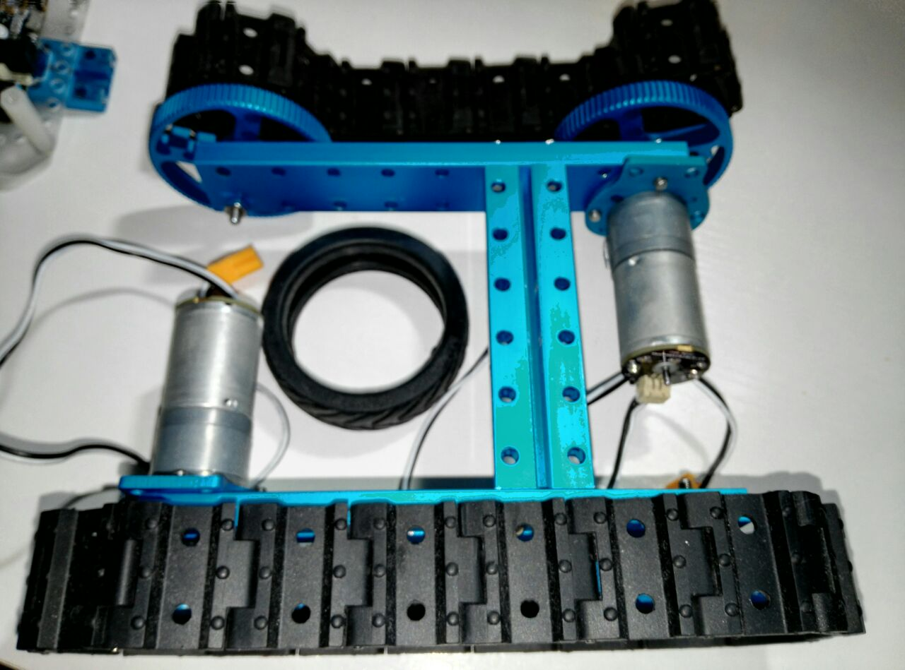

# Robótica

## Curso de Robótica con Starter

### Robot Kit y Ardublock

* Introducción

* Que vamos a aprender

* Que vamos a aprender

* Otros proyectos

* ¿Qué vamos a usar?

# Starter Robot Kit

* Compuesto de una estructura resistente de aluminio y un controlador Makeblock Orion basado
en Arduino UNO, un sensor de ultrasonidos para que esquives obstáculos, y todas las 
estructuras y electrónica necesaria para que aprendas a construir robots de una forma muy sencilla.

* Podrás construir 2 tipos de robots diferentes y siempre los podrás ampliar con otras estructuras
de Makeblock y kits de extensión.

* No requiere ningún conocimiento de electrónica

# Ardublock

# ¿Qué es Makeblock?

* Makeblock es la nueva generación de kits de construcción.
Realizado con aluminio reforzado, su exclusivo diseño permite que
todas sus piezas puedan ensamblarse de forma muy sencilla.

* Es la opción perfecta para construir todo tipo de robots, impresoras 3D, máquinas 
CNC o cualquier idea que tengas en la cabeza. Sólo te hará falta conectar algunas 
estructuras de Makeblock y tu creación la tendrás lista en poco tiempo.

* Su gran estabilidad se debe a un diseño fuerte y modular de aluminio.

* Las conexiones mediante raíles roscados con agujeros hace que los montajes 
sean muy sencillos y se adapten prácticamente a cualquier proyecto que puedas imaginar.

# Compatible con Arduino

* Makeblock se basa en el popular microcontrolador opensource Arduino.

*Esto significa que todo lo que hagas podrá ser controlado desde tu PC, un 
módulo bluetooth o desde muchos otros dispositivos. Y a demás en internet podrás encontrar
numerosos ejemplos con su código fuente para que te resulte más sencillo aún.

# Open Source

* Makeblock será siempre Open Source Hardware con licencia **CC-BY-SA3.0**. Los
esquemas, planos, firmware y todo lo que necesites customizar será publicado con 
esa misma licencia.

# Conexiones flexibles

* Conectar partes entre sí resulta realmente sencillo y rápido: sus vigas roscadas te
permiten atornillar cualquier otra pieza a lo largo de la viga sin necesidad de usar tuercas.

# La rueda multifunción

*Una rueda de transmisión puede usarse también como rueda de coche o rueda de
tanque.

# Rueda de tanque

* Las ruedas de tanque se ensamblan eslabón a eslabón, por lo que podrás hacerla 
todo lo grande que necesites.

# Compatible con Lego

* La distancia básica de los agujeros en Makeblock es la misma que la de Lego, por lo
que podrás unir tus piezas de Lego con suma facilidad.

# Movimiento lineal

* ¡Hasta puedes hacer impresoras!. Los acertados diseños de raíles y ruedas
deslizantes te permiten amplias posibilidades de construcción de movimientos líneales
controlados por ruedas y correas de distribución.

# Motores

* Dispones de una amplia variedad de
motores para tus diseños; motores DC,
motores paso a paso, servos... etc...

# Cableados sencillos

* No te hará falta soldar cables o usar placas de prototipado, porque todas las
conexiones ahora son plug and play mediante conectores RJ25 y códigos de colores.

# Compatible con Arduino

* Todos los módulos electrónicos son compatibles con la plataforma opensource Arduino.

# Ardublock: Herramienta gráfica de Arduino para Makeblock

* Ardublock es una herramienta gráfica para programar cualquier Arduino.
* Se compone de varios bloques que puedes arrastrar y enlazarlos entre 
ellos como si fueran piezas de un puzzle para confeccionar el flujo de 
acciones de tu programa.

# Gracias  

